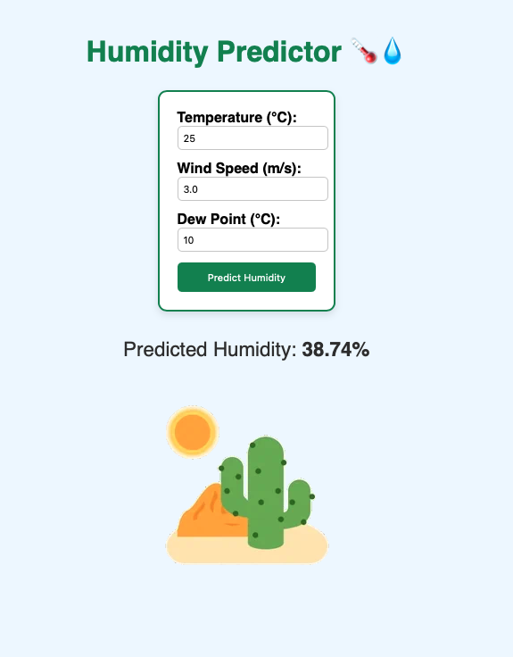
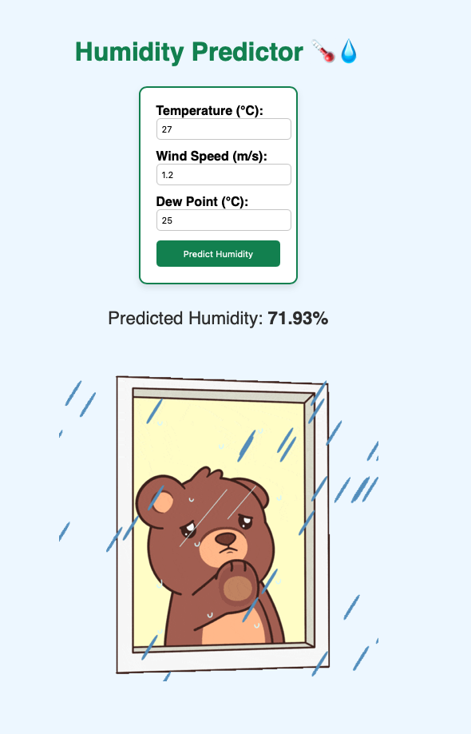

#   Humidity Predictor

**Objective**: Helping users understand atmospheric humidity levels using a machine learning model trained on weather data — providing clear, real-time predictions through an interactive web app.

This Flask-based app predicts relative humidity based on input features like temperature, wind speed, and dew point. The model was trained using historical weather data and served via a user-friendly interface. Depending on the predicted value, the app dynamically shows a matching weather-themed GIF to enhance the user experience.

---

## 🔍 Features

- 📈 Predicts relative humidity (%) based on real input values  
- 🌬️ Accepts input for temperature (°C), wind speed (m/s), and dew point (°C)  
- 🧠 Uses a trained regression model for humidity prediction  
- 🌦️ Displays an animated GIF based on prediction level (low = desert, high = rain)  
- 🖥️ Fully responsive UI built with Flask and HTML/CSS  

---

## 🛠️ Tech Stack

| Layer      | Tech                          |
|------------|-------------------------------|
| Frontend   | HTML, CSS (inline)            |
| Backend    | Python, Flask                 |
| Model      | Scikit-learn, NumPy, pandas   |
| Dev Tools  | VS Code, Git, GitHub          |

---

## 🎬 Demo

| High Humidity  | Low Humidity |
|----------------------|---------------------|
|  |  |

---

## 🧪 Example Inputs

| Feature           | Example Value |
|-------------------|---------------|
| Temperature (°C)  | 27            |
| Wind Speed (m/s)  | 1.2           |
| Dew Point (°C)    | 25            |

**Predicted Humidity:** `71.93%`

| Feature           | Example Value |
|-------------------|---------------|
| Temperature (°C)  | 25            |
| Wind Speed (m/s)  | 3.0           |
| Dew Point (°C)    | 10            |

**Predicted Humidity:** `38.74%`

---

## 🚀 Run Locally

1. **Clone the repository**
```bash
git clone https://github.com/Allanx495/humidity-predictor.git
cd humidity-predictor
